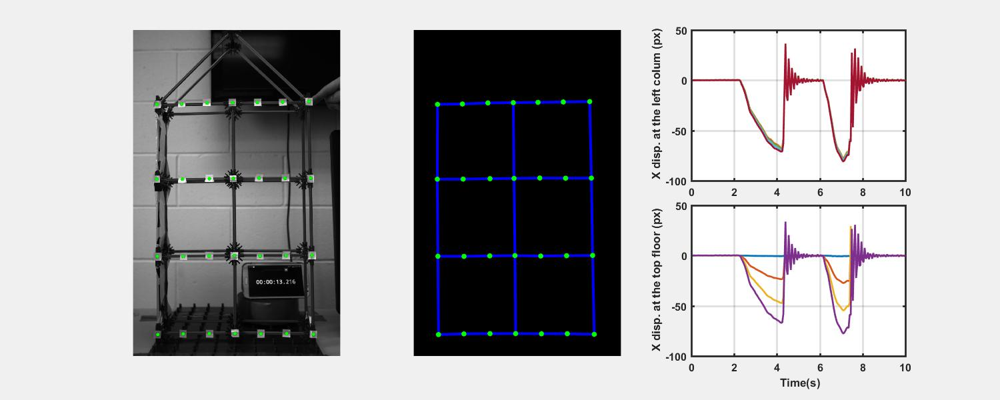

# Vision based Vibration Measurement on a Building Structural Model

## Description
I took a video of a moving building structural model to capture the displacements on key locations. Fiducial targets (black dots) are installed on the key locations, and their locations in each frame of the video are obtained using image processing methods. Assuming that the structure has only in-plane motion, the pixel coordinate of the key locations can be converted to a physical displacement. This work can give you a basic idea of how vision-based displacement measurement works. 

## Source Code & Data
* All source code and data are released in this repository. 
* You can feel free to use the code and data for your research !!

## How to run
Once you download the source code and images in your directory, you can simply run `RunDemo` and the video will be created in the "result" folder. 

